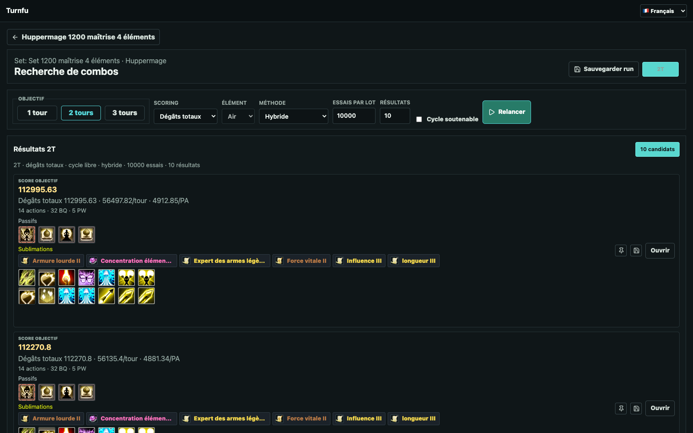
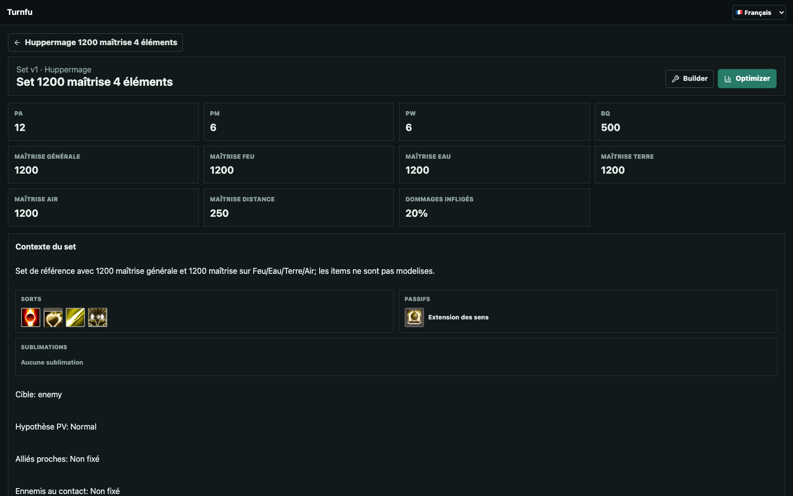
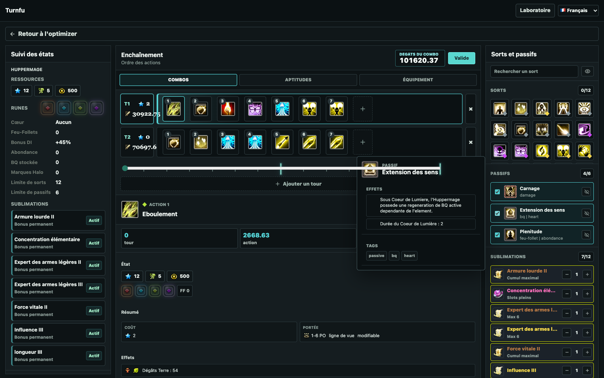
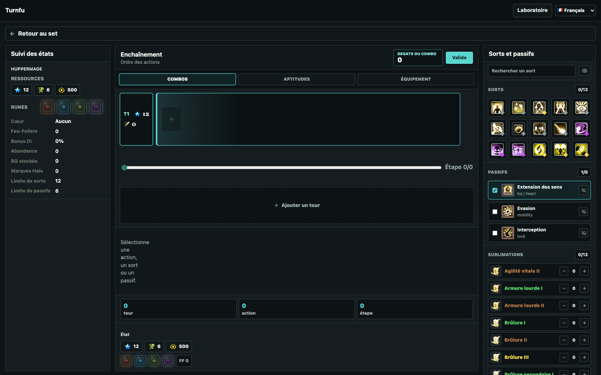

# Turnfu

**Trouver les meilleurs combos Wakfu pour un build et une situation donnés.**

Turnfu explore les enchaînements possibles, les simule, puis classe ceux qui remplissent le mieux l'objectif choisi. L'idée n'est pas seulement de trouver le sort qui frappe le plus fort, mais une suite d'actions cohérente avec les PA, les ressources, les passifs, les sublimations et le contexte du combat.



## À quoi sert le projet ?

Turnfu aide à répondre à des questions concrètes de theorycraft :

- Quel combo produit le plus de dégâts en un, deux ou trois tours ?
- Quel enchaînement privilégier pour un élément précis ?
- Quels passifs et quelles sublimations accompagnent le mieux le combo ?
- Combien le combo rapporte par tour ou par PA dépensé ?
- La séquence reste-t-elle valide avec les ressources disponibles ?
- Quel combo conserver pour le comparer ou le rejouer plus tard ?

Le projet se concentre actuellement sur l'**Huppermage**. Les autres classes visibles dans l'interface ne sont pas encore disponibles.

## Le parcours en quelques étapes

### 1. Décrire le build et son contexte

Un set regroupe les caractéristiques, les ressources de départ, les sorts, les passifs et les hypothèses utiles au combat. Il devient ainsi possible de comparer des combos dans une situation connue, plutôt que dans un cas théorique trop vague.



### 2. Choisir ce que l'on cherche

Dans l'Optimizer, on indique notamment :

- la durée du combo : 1, 2 ou 3 tours ;
- l'objectif : dégâts totaux ou dégâts d'un élément ;
- le nombre de résultats à comparer ;
- si le combo doit former un cycle soutenable.

Turnfu teste alors de nombreuses possibilités et présente les meilleurs candidats avec leur score, leurs dégâts par tour, leur rendement par PA et leur consommation de ressources.

### 3. Comparer les meilleures propositions

Chaque résultat expose immédiatement les sorts joués, les passifs et les sublimations associés. Un combo intéressant peut être épinglé, sauvegardé ou ouvert pour être étudié plus finement.

### 4. Comprendre le combo action par action

La vue détaillée reconstitue les tours dans l'ordre, affiche les dégâts de chaque action et suit l'évolution des ressources et des états de l'Huppermage. Elle permet de comprendre *pourquoi* un combo fonctionne et de l'ajuster avant de le tester en jeu.



## Composer et vérifier une idée manuellement

Le Builder sert aussi de petit laboratoire : on peut construire un enchaînement à la main, choisir les sorts et passifs, puis suivre son coût et ses effets au fil des actions.



## État actuel

- Huppermage jouable avec ses sorts, passifs, runes et BQ.
- Combos sur un à trois tours.
- Classement par dégâts totaux ou élémentaires.
- Prise en compte des caractéristiques, passifs et sublimations modélisés.
- Sauvegarde locale des builds, recherches et combos.
- Comparaison et inspection détaillée des meilleurs résultats.

Turnfu reste un outil de theorycraft en évolution. Certains effets sont signalés comme non pris en charge lorsqu'ils ne sont pas encore modélisés ; les résultats doivent donc être confrontés aux règles et aux tests en jeu.

## Lancer Turnfu

Prérequis : une version récente de Node.js et `pnpm`.

```bash
pnpm install
pnpm dev
```

Ouvrir ensuite [http://localhost:5173](http://localhost:5173).
