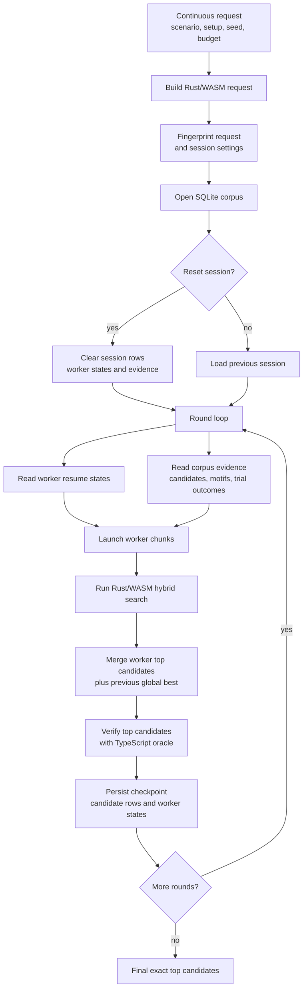
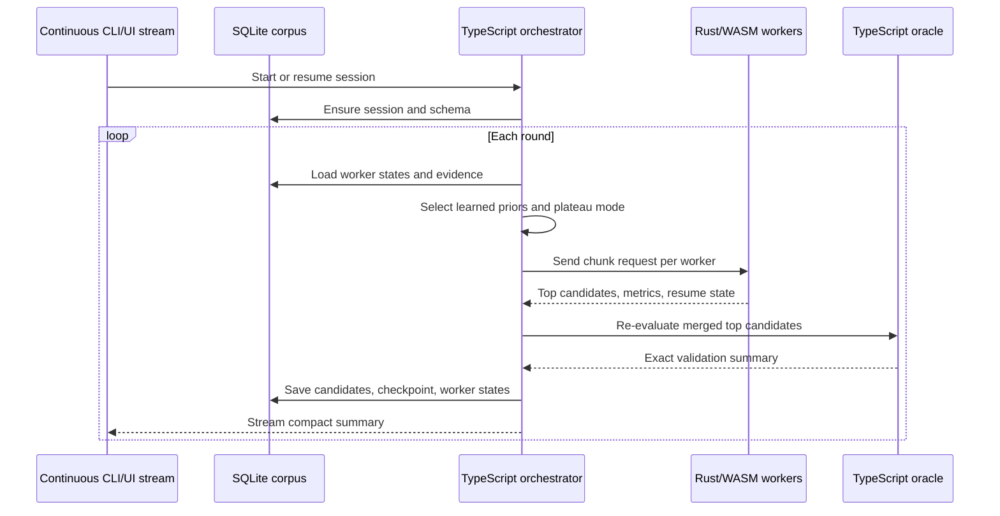
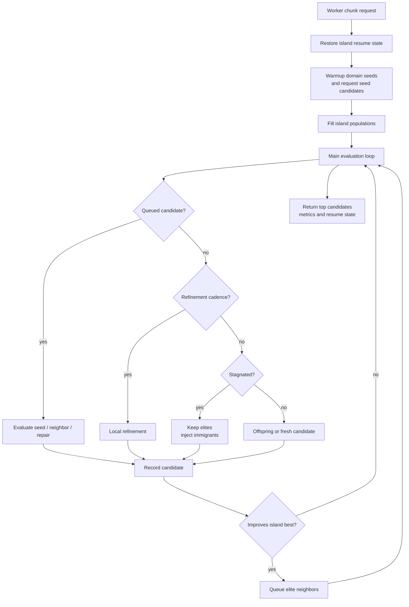
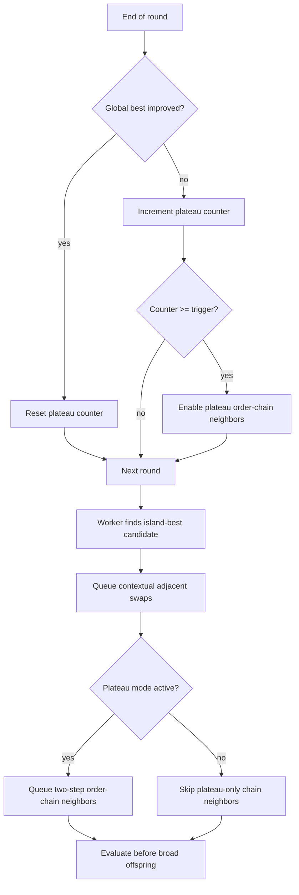
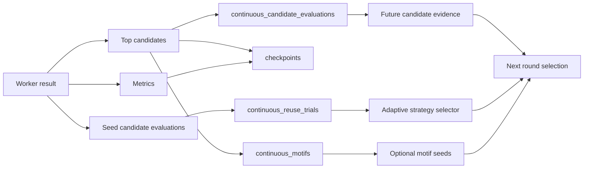

# Continuous search algorithm

This document describes the current `Continuous` optimizer algorithm. It covers
the persistent TypeScript/SQLite orchestration and the Rust/WASM hybrid search
policy used inside each worker chunk.

The current validated quality path is not "more random volume". It is a
compounding Rust/WASM search that preserves exact simulator-backed results,
narrows the search space with learned priors, and uses plateau-only structured
neighbors when the global best stops improving.

## Current validated preset

The current default quality setting is:

```text
--resource-aware-fresh-chance 1
--learned-loadout-prior
--learned-action-set-prior
--contextual-adjacent-swaps
--plateau-order-chain-neighbors
--plateau-trigger-rounds 1
```

On the `learned-loadout-10m` validation seed this reached the current record
score, `188558.81`, by `3M` attempts and held it through `10M` attempts with
TypeScript oracle `5/5`. The prior baseline reached the same record only at
`10M`, so the accepted improvement is faster time-to-record without a final
score regression.

The learned action set is now intentionally broad enough to keep all Huppermage
spells except `mur-energie`, `forteresse-solaire`, and `visio-imperium`. The
learned passive pool keeps at least the core Huppermage mechanics:
`transcendance-runique`, `plenitude`, `universalite`,
`combinaison-elementaire`, `antithese`, `dynamo`,
`refraction-elementaire`, `profusion-runique`, `initiative-de-lame`, and
`sauvegarde-runique`.

Budgets below `1M` attempts are only smoke tests. Search-quality conclusions
must come from matched runs at `1M+`, preferably `5M` or `10M` when validating a
new policy.

## System shape



The TypeScript process in `scripts/search-rust-wasm-sqlite.ts` is the
orchestrator. It owns persistence, session resume, worker allocation, checkpoint
summaries, evidence aggregation, and final oracle validation. Rust/WASM owns
high-volume candidate generation and scoring inside each chunk.

## Per-round orchestration

Each round reads the previous worker states and the previous global best before
launching worker chunks. That is what makes a long run resumable without relying
on the browser page lifecycle.



The streamed summary includes total attempts, valid rate, current score,
effective flags, oracle status, and policy telemetry such as contextual-swap and
plateau-order-chain candidate counts.

## Rust/WASM island policy

Inside a worker chunk, the Rust/WASM request runs the hybrid island search. Each
worker has a deterministic seed derived from the session seed and worker index,
and each worker receives its own resume state.



Candidate pressure currently comes from:

| Source | Purpose |
| --- | --- |
| Domain warmup | Keep known Huppermage branch skeletons in the initial population. |
| Learned loadout prior | Restrict passive and sublimation search to a relevant pool without locking one fixed passive set. |
| Learned action-set prior | Keep all Huppermage spells except the explicitly excluded low-relevance spells. |
| Resource-aware fresh candidates | Generate affordable AP/MP/WP/BQ shapes instead of mostly invalid random plans. |
| Local refinement | Mutate elite plans with small edits. |
| Elite neighbor queue | Immediately test structured neighbors around a new island best. |
| Contextual adjacent swaps | Swap adjacent actions only for validated spell-order pairs. |
| Plateau order-chain neighbors | During plateau mode, test two adjacent swaps that move validated spell chains together. |
| Repair queue | Recover useful prefixes from invalid branches. |
| Restarts and immigrants | Refresh stale islands while keeping elites. |

Final ranking still comes from simulator-backed scores. Discovery and evidence
signals can choose what to try, but they do not replace exact scoring.

## Plateau order-chain mode

Plateau mode is controlled by the TypeScript orchestrator. It is active only
when all of these are true:

- `--plateau-order-chain-neighbors` is enabled;
- a previous global best exists;
- rounds since global-best improvement are at least `--plateau-trigger-rounds`.

When active, the orchestrator sets `hybridPlateauOrderChainNeighbors` on the
Rust/WASM request for that round.



The order-chain neighbor is deliberately narrow. It creates two adjacent swaps
around supported spell-order chains, labels them as
`neighbor:plateau-order-chain:*`, and reports whether they were evaluated, valid,
improved an island, or improved the previous global best. This keeps plateau
escape focused on relevance rather than increasing entropy everywhere.

## Corpus and evidence

The SQLite corpus stores facts that survived exact evaluation:



Promoted seed storage was removed because exact candidate replay did not improve
search quality and became dead weight once promoted seed reuse was disabled. The
current corpus keeps evidence and trial outcomes instead:

- high-scoring valid candidates;
- checkpoint top candidates;
- motif support and rediscovery counts;
- reuse-trial candidates and their exact result deltas;
- strategy-level aggregates for adaptive suppression.

The adaptive reuse selector can suppress strategies that have enough evaluated
trials, no global-best wins, and negative average score delta. This is evidence
management, not a proven quality win yet. The validated quality path remains the
learned priors plus contextual swaps plus plateau order-chain neighbors, with
the caveat that the current spell/passive pools have been widened for relevance
coverage and should be revalidated at `1M+`.

## Validation contract

Any proposed improvement must be validated against this contract:

| Requirement | Rule |
| --- | --- |
| Budget | `1M` minimum for signal; `5M` or `10M` for promotion. |
| A/B shape | Same scenario, seed, workers, chunk size, rounds, and oracle settings. |
| Ranking | Final top candidates must pass TypeScript oracle validation. |
| Acceptance | Improve final score, improve time-to-record without regression, or provide direct evidence for a promoted mechanism. |
| Documentation | Record hypothesis, command shape, result, failure, and conclusion in the observation log. |

The current accepted plateau result meets the time-to-record path: same final
record as baseline, reached materially earlier, with direct telemetry showing
plateau order-chain candidates were generated and evaluated.
