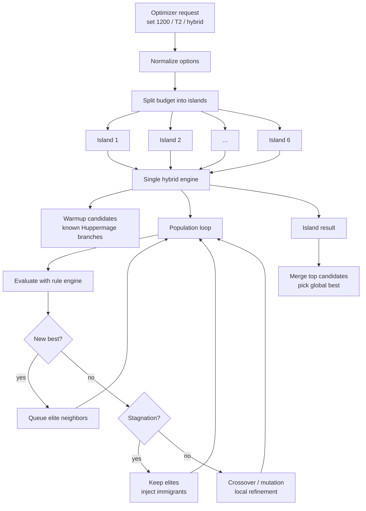
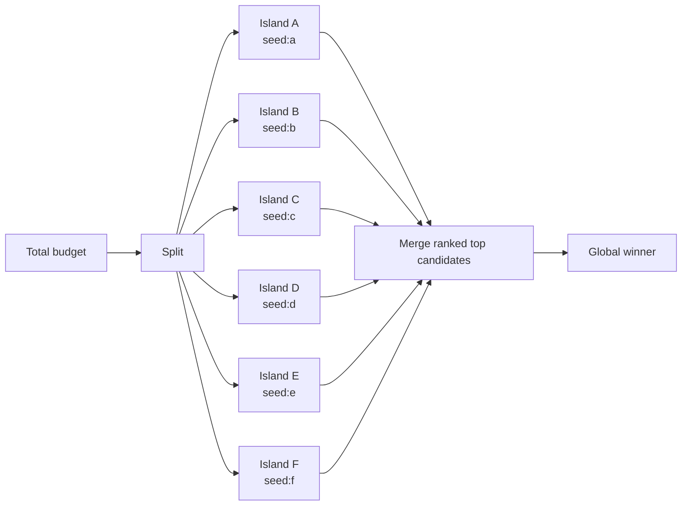
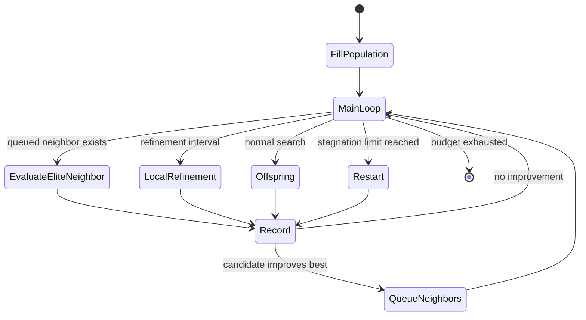
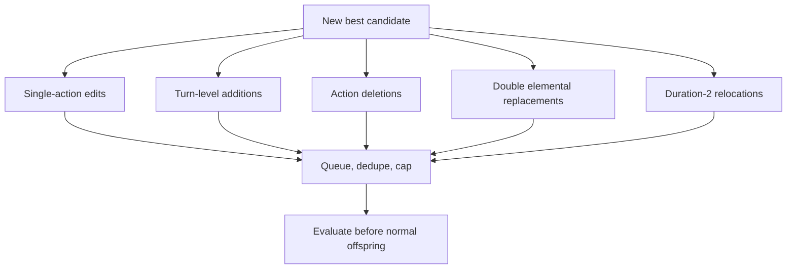
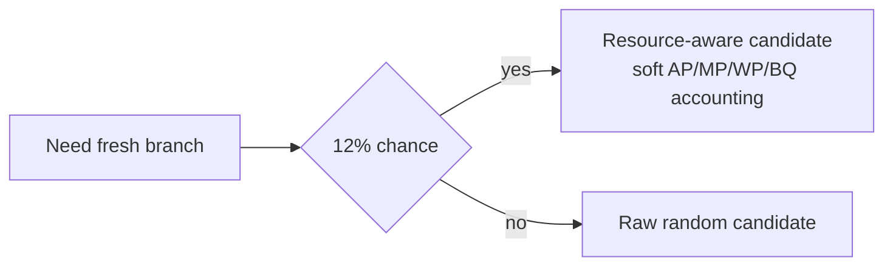
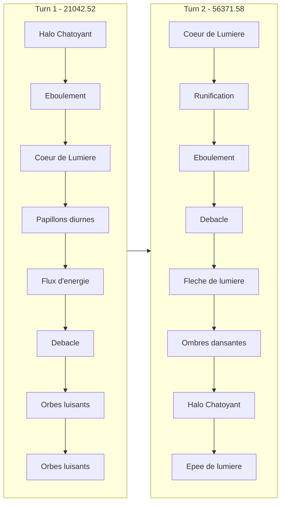
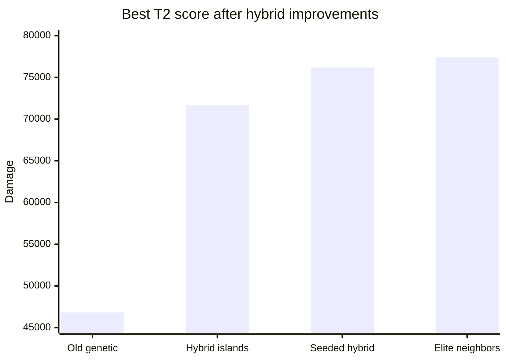

# Hybrid optimizer architecture

This document explains the T2 Huppermage search strategy implemented by the `hybrid`
optimizer. The current goal is not to make random search larger; it is to combine
several complementary search pressures so strong branches are found, preserved,
and locally exploited.

## Search shape



## Candidate sources

The hybrid engine alternates between exploitation and exploration. Each source
has a distinct job:

| Source | Role | Typical effect |
| --- | --- | --- |
| Domain warmup | Starts from known high-value Huppermage branches and adapts them to action/passive caps | Avoids spending budget rediscovering strong branch skeletons |
| Genetic offspring | Crosses strong candidates and mutates them | Keeps broad recombination pressure |
| Local refinement | Mutates elite candidates by a few small steps | Exploits nearby improvements |
| Elite neighbor queue | Tests targeted single and double changes around new bests | Escapes shallow local plateaus |
| Repair queue | Reuses simulator violations to shorten invalid T3 branches | Recovers useful prefixes from overfull long plans |
| Immigrants | Replaces stale population tail after stagnation | Restarts search while preserving elites |
| Resource-aware fresh branches | Generates budget-plausible plans using AP/WP/BQ heuristics | Reduces obviously invalid fresh candidates without removing raw random exploration |

## Island model

Large budgets are divided into independent islands. Each island gets its own RNG,
sampler, evaluator cache, population, restarts, and elite-neighbor queue.



This makes the search less sensitive to one bad random path. It also keeps
restart behavior local to each branch family. Within each island, restart
stagnation is capped at the current population size rather than a smaller
fraction, so target-preserving repairs and elite neighbors get enough time to
run before the island injects fresh immigrants.

## Inner loop



The important detail is the `QueueNeighbors` transition. Before this change, a
new best could be found and then lost in broad random pressure. Now a new best
immediately creates a compact queue of nearby candidates to test.

## Elite-neighbor generation

When a candidate becomes the best known result, the optimizer generates a bounded
neighbor queue.



Double replacements matter because the current best improvement was not reachable
by a single edit. Around the 76k branch, exhaustive two-action replacement found:

```text
T2: papillons-diurnes -> eboulement
T2: eboulement        -> ombres-dansantes
```

That raised the best score from `76186.46` to `77414.10`. Duration-two searches
also get a bounded relocate neighborhood: one action can move to another slot in
the same turn. This is intentionally disabled for duration-three searches after
benchmarks showed it can spend useful T3 queue capacity without improving the
best long-line score.

## Resource-aware fresh branches

Resource-aware generation is intentionally only a fraction of fresh branches.
Fully constraining random search made the optimizer too conservative in earlier
experiments. The current rule is:



The soft resource model tracks AP/MP resets per turn and WP/BQ carry-over. It
filters actions by approximate affordability and cast limits, then chooses among
valid-looking actions with damage/resource weights.

## Best known branch

Current best under the T2 1200-stat setup:



Passives:

```text
carnage
extension-des-sens
profusion-runique
```

Score:

```text
Turn 1: 21042.52
Turn 2: 56371.58
Total : 77414.10
```

## Benchmark progression



| Step | Best score | What changed |
| --- | ---: | --- |
| Old genetic run | `46818.55` | Baseline reported from 1,000,000 genetic iterations |
| Hybrid islands | `71660.96` | Restarts, islands, immigrants, local refinement |
| Seeded hybrid | `76186.46` | Known high-value branch becomes warmup seed |
| Elite neighbors | `77414.10` | Double-replacement exploration around new bests |

## Current limit

The best branch is a strict local optimum for tested one-step and two-step
neighborhoods:

```text
One-step neighborhood around 76186.46:
  tested: 819
  valid : 288
  better: 0

Two-step neighborhood around 77414.10:
  tested: 182520
  valid : 29516
  better: 0
```

The next useful architecture step is not more random volume. The hybrid engine
now seeds small structured neighborhoods from improved elites: adjacent
action-order swaps around burst windows, duration-two action relocations, and
passive-set variants around known spell skeletons. Known domain branches can
also be reused as longer-duration prefixes; for example, a strong two-turn
Huppermage seed can initialize a three-turn search and leave later turns open
for extension. The seed adapter respects action-count caps by truncating known
turns instead of discarding the whole branch, and it now adapts passive caps by
trying weighted subsets of the seed passives. This keeps capped searches
anchored to useful Huppermage openers even when the requested passive count is
lower than the original seed. When extending a shorter seed, the warmup also
tries known prior turns as full next-turn templates before falling back to
single weighted actions.

The elite-neighbor queue is intentionally bounded by bucket: expensive
two-action replacement neighbors cannot consume the whole generated queue before
deletions, appends, and single-action replacements are considered.

Mutation pressure is also adjusted for dense three-turn branches. Once a turn is
at least 75% full, deletion is sampled more often than on sparse turns, which
keeps long T3 offspring from repeatedly over-spending saturated suffixes while
leaving T2 capped searches unchanged.

For multi-turn searches, invalid candidates now contribute one repair candidate
when the simulator reports a precise failing `turnIndex` and `actionIndex`. The
repair trims the rest of the failing turn from that action onward, then queues
the shortened plan as a normal future hybrid candidate. This keeps the valid
prefix while avoiding several repeated invalid repair attempts on an over-spent
suffix. T2 repair is enabled only beyond tiny budgets, so 16-iteration warmups
still prioritize immediate elite neighbors while longer capped searches can cut
invalid candidates. Repair processing is also burst-capped to two consecutive
repairs. After that, the loop must give queued elite neighbors or normal
offspring a chance to run; this prevents repair cascades from starving
exploration on long budgets.

Three-turn elite neighbors also include a small targeted relocate pass around
Huppermage pivot spells such as `coeur-de-lumiere`, `runification`,
`fleche-de-lumiere`, and `epee-de-lumiere`. This keeps the broad relocate
search limited to T2, while still letting long T3 budgets fix local ordering
around the high-value pivots. On the reference Huppermage benchmarks it found
the current best T3 warmup line without changing the verified T2 capped scores.
For broader T3 passive budgets, the neighborhood expands around `halo-chatoyant`,
`debacle`, and `orbes-luisants`, and can flip empty-cell capable actions or
insert weighted actions near those pivots. The full expansion is disabled for
3-passive T3 searches, where benchmarks showed the narrower pivot set is cleaner,
but long-budget 3-passive searches still use the cheaper target-flip pass. This
keeps the low-budget warmup unchanged while giving longer capped searches a small
way to test empty-cell variants.

Long-budget multi-turn mutation also tries this target flip before destructive
append, delete, or replacement mutations when the selected turn contains a spell
that can exist with or without an empty-cell target. This preserves the action
order and resources of strong branches while exploring an axis that materially
changes validity. It is gated to budgets of at least 80 iterations so tiny
warmups keep their deterministic seed-first behavior.

The best repair-discovered three-turn branches are now also domain warmup seeds.
The robust `102536.53` line is kept first to preserve early search diversity,
then the `103545.66` line follows so small-budget T3 searches still start from
the strongest known damage branch instead of spending early iterations
rediscovering it. High-budget T2 capped discoveries are also promoted back into
warmup seeds so constrained two-turn searches do not need to rediscover their
best known branches. The capped T2 warmups currently seed `71364.22` for the
7-action/3-passive setup and `73204.18` for the 8-action/2-passive setup; the
3-passive seed is gated by passive capacity so it does not delay the 2-passive
branch at very small budgets.

Larger structured moves remain useful, for example:

- whole-turn template recombination;
- richer validity-repair guided by simulator violation types. A constructive
  repair experiment that inserted cheap rune generators before class-state
  violations was tested and rejected because it slightly reduced T3 valid rates
  without improving best scores.
